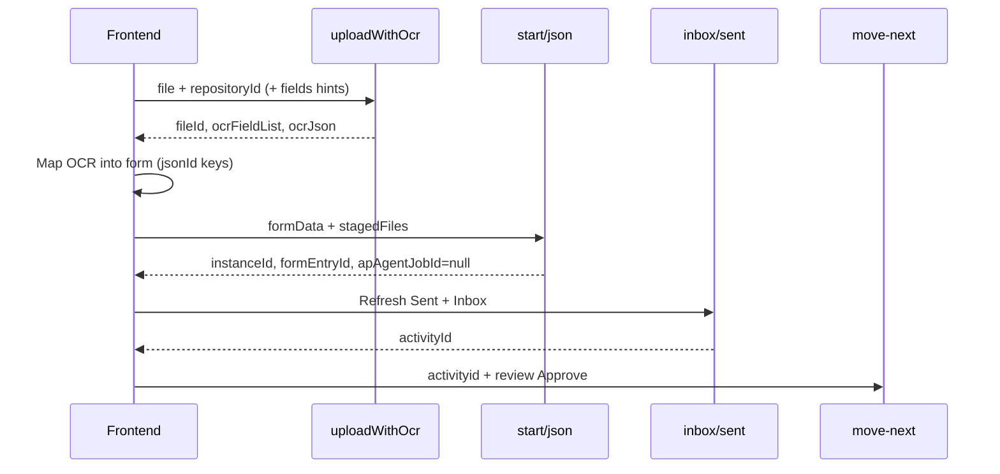

# Normal Workflow — Frontend Guide

**Audience:** Frontend  
**Last updated:** August 2026  
**Merged in:** PR #40 (`main`)

Start and progress a **normal** workflow (no dedicated AP Agent step): pre-ticket OCR upload → temp/stage storage → start with `formData` + `fileId` → archive on start → Inbox/Sent → `move-next`.

AP Agent workflows (`stageType: AP_AGENT` or step name `Ap Agent`) keep the existing start + Python job path. Do **not** use this guide for those.

---

## Table of contents

1. [End-to-end flow](#1-end-to-end-flow)
2. [Create / publish a normal workflow](#2-create--publish-a-normal-workflow)
3. [Get formId and field jsonIds](#3-get-formid-and-field-jsonids)
4. [Upload with OCR (pre-ticket)](#4-upload-with-ocr-pre-ticket)
5. [Start workflow](#5-start-workflow)
6. [Inbox / Sent](#6-inbox--sent)
7. [Move-next](#7-move-next)
8. [Normal vs AP Agent](#8-normal-vs-ap-agent)
9. [FE checklist](#9-fe-checklist)
10. [Errors](#10-errors)

Auth on all routes:

```http
Authorization: Bearer {jwt}
```

Tenant comes from JWT / tenant context (same as other V6 APIs).

---

## 1. End-to-end flow



| Step | API | Result |
|------|-----|--------|
| 0 | `POST /api/workflows` + publish | Normal workflow (no AP Agent block) |
| 1 | `POST /api/uploadAndIndex/uploadWithOcr` | File in **temp/monitor** + stage table + OCR; returns `fileId` |
| 2 | `POST /api/workflows/{id}/start/json` | Instance; form filled; file **archived**; START → next step |
| 3 | `GET …/sent` / `GET …/inbox` | Initiator Sent; assignee Inbox |
| 4 | `POST …/instances/{id}/move-next` | Approver advances |

**Where the file lives**

| After | Location |
|-------|----------|
| `uploadWithOcr` | Temp/monitor path + stage table (`OcrResult` + field values) |
| Successful `start` | Repository **archive** + workflow attachments + `processAddon` |

`POST /api/uploadAndIndex/uploadForOcr` remains **OCR-only** (no stage save). Use `uploadWithOcr` for the normal ticket flow.

---

## 2. Create / publish a normal workflow

```http
POST /api/workflows
Content-Type: application/json
```

Rules for **normal** path:

- Blocks: `START` → `INTERNAL_ACTOR` (and/or CONDITION) → `END`
- **No** block with `"type": "AP_AGENT"` and **no** label `Ap Agent`
- `initiateUsing.type`: `DOCUMENT_FORM` or `FORM` (not email-only)
- `rules[].proceedAction`: e.g. `Submit` (Start → Manager), `Approve` (Manager → End)

### Minimal create example

```json
{
  "name": "IT Requisition",
  "description": "Normal workflow — Start → Manager → End",
  "triggerType": 0,
  "publishImmediately": true,
  "workflowJson": {
    "blocks": [
      {
        "id": "blk-start",
        "type": "START",
        "settings": {
          "label": "Start",
          "initiateMode": "MANUAL",
          "initiateBy": ["USER"],
          "users": ["{user-guid}"],
          "groups": []
        }
      },
      {
        "id": "blk-manager",
        "type": "INTERNAL_ACTOR",
        "settings": {
          "label": "Manager",
          "initiateMode": "MANUAL",
          "initiateBy": ["USER"],
          "users": ["{manager-user-guid}"],
          "groups": []
        }
      },
      {
        "id": "blk-end",
        "type": "END",
        "settings": { "label": "End", "users": [], "groups": [] }
      }
    ],
    "rules": [
      {
        "id": "rule-submit",
        "fromBlockId": "blk-start",
        "toBlockId": "blk-manager",
        "proceedAction": "Submit"
      },
      {
        "id": "rule-approve",
        "fromBlockId": "blk-manager",
        "toBlockId": "blk-end",
        "proceedAction": "Approve"
      }
    ],
    "settings": {
      "general": {
        "name": "IT Requisition",
        "initiateUsing": {
          "type": "DOCUMENT_FORM",
          "repositoryId": "{repository-guid}",
          "formId": "{form-guid}"
        },
        "ocr": { "required": false, "credit": 0 }
      },
      "publish": {
        "publishOption": "PUBLISHED",
        "publishSchedule": "",
        "unpublishSchedule": ""
      }
    }
  }
}
```

Save `workflowId` from the `201` response.

If already created as Draft:

```http
POST /api/workflows/{workflowId}/publish
```

Also see: [`WORKFLOW_CREATE_PAYLOAD_EXAMPLE.md`](./WORKFLOW_CREATE_PAYLOAD_EXAMPLE.md).

---

## 3. Get formId and field jsonIds

### Form id linked to the workflow

```http
GET /api/workflows/{workflowId}
```

Response includes `formId` and `repositoryId`.

### List forms

```http
GET /api/form/all
```

`formId` equals `wFormId` in `wFormControl`.

### Controls (jsonId → name → type)

```http
GET /api/form/{formId}/controls
```

**Prefer `jsonId` as `formData` keys** (FE designer / ezfb columns use these). Field **names** also resolve, but jsonId is the stable contract.

Example invoice controls:

| jsonId | Name | Notes |
|--------|------|--------|
| `RXwLGHILLrreMmRqlk9mj` | PO Number | Mandatory |
| `kvcYuknkDumkTenjvrVLj` | Invoice No | Mandatory |
| `UtfgJy6Z0qyfRC5Bclf-c` | Supplier | |
| `aWaiq3o4hlpb76l-bivmP` | PO Line Item | TABLE — array of child jsonIds |
| `9l_i90JwGJV3WGDGv3dj6` | Invoice Upload | FILE — **not** in formData; use `stagedFiles` |

---

## 4. Upload with OCR (pre-ticket)

```http
POST /api/uploadAndIndex/uploadWithOcr
Content-Type: multipart/form-data
```

| Form key | Required | Notes |
|----------|----------|--------|
| `file` | Yes | PDF / image |
| `repositoryId` | Yes | Same repo as workflow `repositoryId` |
| `filename` | No | |
| `fields` | No | OCR **hints** only (`Supplier,SHORT_TEXT` or JSON array). Not pre-filled values. |
| `pageNo` / `ocrType` / `validateType` | No | |

### `fields` examples

Plain:

```
PO Number,SHORT_TEXT
Invoice No,SHORT_TEXT
Supplier,SHORT_TEXT
```

JSON array:

```json
["PO Number,SHORT_TEXT","Invoice No,SHORT_TEXT","Supplier,SHORT_TEXT"]
```

If omitted, parameters are built from repository field definitions.

### Sample response `200`

```json
{
  "fileId": "3fa85f64-5717-4562-b3fc-2c963f66afa6",
  "repositoryId": "ac40db26-306b-4d13-8aeb-f80a056d9a73",
  "fileName": "invoice.pdf",
  "filePath": "monitor/.../invoice.pdf",
  "ocrJson": "{ ... }",
  "ocrFieldList": [
    { "name": "PO Number", "value": "PO-1001", "type": "SHORT_TEXT" },
    { "name": "Invoice No", "value": "INV-5001", "type": "SHORT_TEXT" }
  ]
}
```

Map `ocrFieldList` into the form UI (by name → jsonId). Keep `fileId` for start.

**Multiple files:** one `uploadWithOcr` call per file; pass all pairs in `stagedFiles`.

---

## 5. Start workflow

### Preferred — JSON

```http
POST /api/workflows/{workflowId}/start/json
Content-Type: application/json
```

```json
{
  "context": "invoice start test",
  "envType": "trial",
  "formData": {
    "RXwLGHILLrreMmRqlk9mj": "PO-1001",
    "kvcYuknkDumkTenjvrVLj": "INV-5001",
    "UtfgJy6Z0qyfRC5Bclf-c": "ACME Corp",
    "bjf8X90UOQSdynK9JeV3q": "USD",
    "aWaiq3o4hlpb76l-bivmP": [
      {
        "pR68_ksXS0oSgd5smtl1b": "1",
        "8I6b0lpLYEGSdAUDnKqof": "Laptop",
        "l2amP5ayOsCaf14j30YQo": "1",
        "IvrIXB1Tf9WhEnEj08tO5": "1500.00",
        "f9eRMcSJknkMLhOfpvgXD": "1500.00"
      }
    ]
  },
  "stagedFiles": [
    {
      "repositoryId": "ac40db26-306b-4d13-8aeb-f80a056d9a73",
      "fileId": "3fa85f64-5717-4562-b3fc-2c963f66afa6"
    }
  ]
}
```

| Property | Required | Notes |
|----------|----------|--------|
| `formData` | No | Object keyed by **jsonId** (or field name) |
| `stagedFiles` | No | `{ repositoryId, fileId }` from `uploadWithOcr` |
| `context` / `envType` | No | |
| `attachment` | No | Legacy base64; prefer `stagedFiles` |

### Multipart alternative

```http
POST /api/workflows/{workflowId}/start
Content-Type: multipart/form-data
```

| Form field | Value |
|------------|--------|
| `formData` | JSON **string** |
| `fileIds` | JSON **string** array of `{ repositoryId, fileId }` |
| `context` / `envType` | Optional |
| `file` | Optional legacy direct upload |

### Sample response `201`

```json
{
  "instanceId": "56d303f6-4fba-4853-a81e-eba65a62d9ea",
  "firstTransactionId": 1,
  "currentTransactionId": 2,
  "formEntryId": 28,
  "apAgentStepInstanceId": "aea3bba3-fb08-476a-9ccf-3aaad73680e1",
  "formDataJson": "{ ... bootstrap payload ... }",
  "formDataBlobPath": "...",
  "startPayload": {
    "workflowId": "...",
    "repositoryId": "...",
    "instanceId": "...",
    "formentryId": 28,
    "formId": "730d0900-fbd7-4898-8c11-f6059a4bb997",
    "itemId": "...",
    "blobPath": "..."
  },
  "apAgentJobId": null
}
```

| Field | Meaning for FE |
|-------|----------------|
| `instanceId` | Use in move-next URL |
| `formEntryId` | ezfb row; pass on move-next if updating form |
| `apAgentJobId` | Must be **`null`** for normal path |
| `apAgentStepInstanceId` | On normal start = **next step** instance id (name is historical) |
| `itemId` / `blobPath` in payload | Set when staged file was archived; empty if no `stagedFiles` / promote failed |

### Backend on normal start

1. Insert ezfb row; apply `formData`.
2. Complete START with review `Submit`; open next step from `ActionsJson`.
3. Promote each staged file → archive + attachments + `processAddon` (`ProcessId` = instance GUID).
4. Link `processForm`; re-sync mailbox so Sent/Inbox show form + file.

---

## 6. Inbox / Sent

```http
GET /api/workflows/sent?workflowId={workflowId}&pageNumber=1&pageSize=20
GET /api/workflows/inbox?workflowId={workflowId}&pageNumber=1&pageSize=20
```

| Who | List |
|-----|------|
| Initiator | **Sent** (START already submitted) |
| Next assignee | **Inbox** — copy `activityId` for move-next |

Optional instance detail:

```http
GET /api/workflows/{workflowId}/instances/{instanceId}
```

Expect START completed and next human step pending.

---

## 7. Move-next

```http
POST /api/workflows/instances/{instanceId}/move-next
Content-Type: application/json
```

```json
{
  "activityid": "{activityId-from-inbox}",
  "review": "Approve",
  "comments": "ok",
  "formId": "730d0900-fbd7-4898-8c11-f6059a4bb997",
  "formEntryId": 28,
  "formData": {
    "RXwLGHILLrreMmRqlk9mj": "PO-1001",
    "kvcYuknkDumkTenjvrVLj": "INV-5001"
  }
}
```

Minimal:

```json
{
  "activityid": "{activityId-from-inbox}",
  "review": "Approve",
  "comments": "ok"
}
```

| `review` | When |
|----------|------|
| `Submit` | START (done automatically on normal start) |
| `Approve` | Approve current step |
| `Reject` | Rejected branch |
| `Satisfied` | Condition path |

Use the `proceedAction` values from that step’s designer rules.

Also: [`FRONTEND_TEAM_API_GUIDE.md`](./FRONTEND_TEAM_API_GUIDE.md) (inbox/sent, bulk move-next).

---

## 8. Normal vs AP Agent

| | Normal | AP Agent |
|--|--------|----------|
| Designer | No `AP_AGENT` / `Ap Agent` step | Has dedicated AP Agent step |
| Pre-upload | `uploadWithOcr` → `stagedFiles` | Optional; start file triggers Python |
| On start | Form + START Submit → next human step | START → AP Agent active |
| `apAgentJobId` | `null` | Hangfire job id when file attached |

---

## 9. FE checklist

- [ ] Workflow published; no AP Agent step
- [ ] `formId` / `repositoryId` from `GET /api/workflows/{id}`
- [ ] Controls from `GET /api/form/{formId}/controls` (jsonIds)
- [ ] `uploadWithOcr` → save `fileId`
- [ ] Map OCR → form; edit; submit `start/json` with jsonId `formData` + `stagedFiles`
- [ ] Confirm `apAgentJobId === null`
- [ ] Refresh Sent (initiator) and Inbox (assignee)
- [ ] move-next with inbox `activityId` + correct `review`

---

## 10. Errors

| HTTP | Cause |
|------|--------|
| `400` | Missing upload file; bad `repositoryId`; invalid `formData` / `fileIds` JSON; OCR `fields` format issues |
| `404` | Unknown workflow or staged `fileId` |
| `401` / `403` | Auth |

**Create workflow** and missing `dbo.connector`: non-email (`DOCUMENT_FORM`) create no longer requires connector rows; API ensures schema as needed.

---

## Related docs

| Doc | Topic |
|-----|--------|
| [`WORKFLOW_CREATE_PAYLOAD_EXAMPLE.md`](./WORKFLOW_CREATE_PAYLOAD_EXAMPLE.md) | Create payload shape |
| [`FRONTEND_TEAM_API_GUIDE.md`](./FRONTEND_TEAM_API_GUIDE.md) | Inbox/sent, bulk move-next |
| [`TEAM_API_GUIDE_CREDITS_AND_WORKFLOW_SHARE.md`](./TEAM_API_GUIDE_CREDITS_AND_WORKFLOW_SHARE.md) | Guest share / verify |
| [`V6_COMPLETED_FEATURES.md`](./V6_COMPLETED_FEATURES.md) | Upload OCR / index overview |
