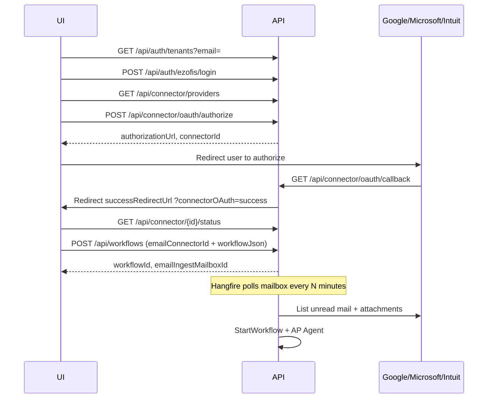

# UI Guide — Connectors (GCP, Outlook, QuickBooks) & Workflow Create

**Audience:** Frontend / UI developers  
**API base:** `https://<host>/api` (local: `http://localhost:5000/api`)  
**Related docs:** [CONNECTOR_OAUTH_HANDOFF.md](CONNECTOR_OAUTH_HANDOFF.md), [EMAIL_AP_AGENT_HANDOFF.md](EMAIL_AP_AGENT_HANDOFF.md)

---

## 1. Before you start

### 1.1 Required headers (after login)

| Header | Value |
|--------|--------|
| `Authorization` | `Bearer <accessToken>` |
| `X-Tenant-Id` | `<tenant-guid>` |
| `Content-Type` | `application/json` (for POST/PUT bodies) |

### 1.2 Login flow (UI)

```
Step 1  User enters email
        GET /api/auth/tenants?email=user@company.com

Step 2  If multiple tenants → show org picker
        If one tenant → auto-select

Step 3  User enters password
        POST /api/auth/ezofis/login
        Header: X-Tenant-Id: <selected-tenant-guid>
        Body: { "email": "...", "password": "..." }

Step 4  Store accessToken + tenantId for all connector/workflow calls
        If 2FA enabled → use tempToken + POST /api/auth/2fa/complete
```

### 1.3 Suggested UI pages

| Page | Purpose |
|------|---------|
| **Connector Hub** | List providers, connect/disconnect, show status |
| **Workflow Designer** | Create/edit workflow; pick email connector + master source |
| **OAuth complete** | Handle redirect after provider login (`/connectors/oauth-complete`) |

---

## 2. Connector Hub — common UI flow

Every provider (GCP, Outlook, QuickBooks) uses the **same** API pattern.

```
┌─────────────────────────────────────────────────────────────────┐
│  Connector Hub                                                   │
│  ┌──────────┐  ┌──────────┐  ┌────────────┐  ┌──────────┐    │
│  │   GCP    │  │ Outlook  │  │ QuickBooks │  │  Gmail   │    │
│  │ Connect  │  │ Connect  │  │  Connect   │  │ Connect  │    │
│  └──────────┘  └──────────┘  └────────────┘  └──────────┘    │
└─────────────────────────────────────────────────────────────────┘
```

### Step 1 — Load available providers

```http
GET /api/connector/providers
Authorization: Bearer <token>
X-Tenant-Id: <tenant-guid>
```

**UI:** Render a card per provider. Use flags from response:

- `supportsFiles` → show file browser (GCP)
- `supportsGmail` → show mail features (Outlook, Gmail)
- `supportsQuickBooks` → show masters/documents (QuickBooks)
- `isConfigured` → hide Connect button if `false` (ops must set ClientId in catalog)

### Step 2 — Load tenant's existing connectors

```http
GET /api/connector/all
Authorization: Bearer <token>
X-Tenant-Id: <tenant-guid>
```

**UI:** Show connected accounts with name, provider, status. Reuse `connectorId` for workflow linking.

### Step 3 — Start OAuth (Connect button)

```http
POST /api/connector/oauth/authorize
Authorization: Bearer <token>
X-Tenant-Id: <tenant-guid>
Content-Type: application/json
```

**Response:**

```json
{
  "connectorId": "7ad18f1b-871f-4094-9a25-98472d897aa0",
  "authorizationUrl": "https://...",
  "state": "..."
}
```

**UI actions:**

1. Save `connectorId` (draft row exists even before OAuth finishes).
2. Redirect user: `window.location.href = authorizationUrl` (or popup).
3. User signs in at Google / Microsoft / Intuit.
4. Provider redirects to API callback (no UI code needed on callback).
5. API redirects browser to your `successRedirectUrl` with query params:

```
https://your-ui/connectors/oauth-complete
  ?connectorOAuth=success
  &connectorId=7ad18f1b-871f-4094-9a25-98472d897aa0
  &provider=OUTLOOK
```

**UI OAuth complete page:**

- Read `connectorOAuth`, `connectorId`, `provider` from URL.
- Call status endpoint (Step 4).
- Navigate back to Connector Hub or Workflow Designer.

### Step 4 — Verify connection

```http
GET /api/connector/{connectorId}/status
Authorization: Bearer <token>
X-Tenant-Id: <tenant-guid>
```

**Response example:**

```json
{
  "connectorId": "7ad18f1b-871f-4094-9a25-98472d897aa0",
  "providerCode": "OUTLOOK",
  "oauthStatus": "Connected",
  "externalAccountEmail": "user@company.com",
  "tokenExpiresAtUtc": "2026-07-21T10:00:00Z",
  "isConnected": true
}
```

**UI:** Show green badge when `isConnected === true`. Show `externalAccountEmail` as the linked account.

### Step 5 — Disconnect (optional)

```http
POST /api/connector/{connectorId}/disconnect
Authorization: Bearer <token>
X-Tenant-Id: <tenant-guid>
```

---

## 3. Provider-specific connect payloads

Use provider code **exactly** as shown (uppercase).

### 3.1 GCP (Google Cloud Storage)

**When:** File storage — upload/download/list in GCS bucket.

**Authorize request:**

```json
{
  "providerCode": "GCP",
  "name": "Production GCS",
  "configJson": "{\"bucket\":\"my-company-bucket\"}",
  "successRedirectUrl": "https://your-ui/connectors/oauth-complete"
}
```

| Field | Required | Notes |
|-------|----------|-------|
| `name` | Yes | Display name in Connector Hub |
| `configJson.bucket` | **Yes** | GCS bucket name |
| `successRedirectUrl` | Recommended | Where to land after OAuth |

**After connect — test in UI:**

```http
GET /api/connector/{id}/files?path=
POST /api/connector/{id}/files/upload   (multipart: file, optional path)
GET /api/connector/{id}/files/download?path=folder/file.pdf
```

**Ops checklist (Google Cloud Console):**

- OAuth client redirect URI must match catalog `RedirectUri` exactly, e.g.  
  `https://your-host/api/connector/oauth/callback`
- Enable Google Cloud Storage API for the project.

---

### 3.2 Outlook (Office 365 mail)

**When:** Read/send mail, email AP workflow, attachment download.

**Authorize request (new connector):**

```json
{
  "providerCode": "OUTLOOK",
  "name": "AP Inbox",
  "successRedirectUrl": "https://your-ui/connectors/oauth-complete"
}
```

`configJson` is optional for Outlook.

**Re-authorize** (after scope change or token issues):

```json
{
  "providerCode": "OUTLOOK",
  "connectorId": "7ad18f1b-871f-4094-9a25-98472d897aa0",
  "successRedirectUrl": "https://your-ui/connectors/oauth-complete"
}
```

**After connect — test in UI:**

```http
GET /api/connector/{id}/mail/summary
GET /api/connector/{id}/mail/messages?unreadOnly=true&maxResults=10
GET /api/connector/{id}/mail/messages/{messageId}
POST /api/connector/{id}/mail/messages/{messageId}/read
GET /api/connector/{id}/mail/messages/{messageId}/attachments/{attachmentId}
```

**Ops checklist (Azure App Registration):**

- Redirect URI: same as catalog `RedirectUri`
- Delegated permissions: `Mail.ReadWrite`, `User.Read`, `offline_access`, `openid`, `profile`, `email`
- If users connected before scope bump → show **Re-connect** button

---

### 3.3 QuickBooks Online

**When:** Resolve Vendor/Customer/Item masters and list/download invoices, bills, POs.

> Use provider code **`QUICKBOOKS`** — not `QUICKBOOKS_EMAIL`.

**Authorize request (production):**

```json
{
  "providerCode": "QUICKBOOKS",
  "name": "QuickBooks Production",
  "successRedirectUrl": "https://your-ui/connectors/oauth-complete"
}
```

**Authorize request (sandbox):**

```json
{
  "providerCode": "QUICKBOOKS",
  "name": "QuickBooks Sandbox",
  "configJson": "{\"environment\":\"sandbox\"}",
  "successRedirectUrl": "https://your-ui/connectors/oauth-complete"
}
```

**Re-authorize:**

```json
{
  "providerCode": "QUICKBOOKS",
  "connectorId": "<existing-qbo-connector-guid>",
  "successRedirectUrl": "https://your-ui/connectors/oauth-complete"
}
```

**Important:** On successful OAuth, API stores Intuit **`realmId`** as `externalAccountId`. If masters/documents fail with `realmId is missing`, user must disconnect and connect again.

**After connect — test in UI:**

```http
GET /api/connector/{id}/quickbooks/masters?masterType=Vendor
GET /api/connector/{id}/quickbooks/masters?masterType=Customer
GET /api/connector/{id}/quickbooks/masters?masterType=Item

GET /api/connector/{id}/quickbooks/documents?documentType=Invoice
GET /api/connector/{id}/quickbooks/documents?documentType=Bill
GET /api/connector/{id}/quickbooks/documents/{documentId}/pdf?documentType=Invoice
```

**Ops checklist (Intuit Developer):**

- Redirect URI matches catalog
- Scopes: `com.intuit.quickbooks.accounting openid profile email`
- Use sandbox company for `environment: sandbox` connectors

---

## 4. Workflow create — UI step-by-step

Workflow create requires **Admin** role: `POST /api/workflows`.

### 4.1 UI wizard (recommended)

```
Step A  Basic info (name, description)
Step B  Initiate by: [ ] User  [ ] Email
Step C  If Email → pick Outlook/Gmail connector (dropdown from GET /api/connector/all)
Step D  Master source: Internal Form OR QuickBooks
Step E  If Internal Form → pick masterFormId (vendor form)
        If QuickBooks → pick QuickBooks connector
Step F  Designer blocks (START, activities, END) — optional full JSON
Step G  Publish now? [x]
Step H  POST /api/workflows → show emailIngestMailboxId in success toast
```

### 4.2 Example — Email AP workflow (Internal Form master)

Use when invoices arrive by **Outlook/Gmail** and vendors come from an internal form.

```http
POST /api/workflows
Authorization: Bearer <token>
X-Tenant-Id: <tenant-guid>
Content-Type: application/json
```

```json
{
  "name": "Accounts Payable",
  "description": "Email invoice intake",
  "triggerType": 0,
  "publishImmediately": true,
  "emailConnectorId": "7ad18f1b-871f-4094-9a25-98472d897aa0",
  "emailIsEnabled": true,
  "emailPollIntervalMinutes": 5,
  "emailQueryFilter": "has:attachment subject:invoice",
  "masterSource": "InternalForm",
  "masterFormId": "730d0900-fbd7-4898-8c11-f6059a4bb997",
  "workflowJson": {
    "Settings": {
      "General": {
        "Name": "Accounts Payable",
        "InitiateUsing": { "Type": "EMAIL" }
      },
      "Publish": { "PublishOption": "PUBLISHED" }
    },
    "Blocks": [
      {
        "Id": "start-1",
        "Type": "START",
        "Settings": {
          "InitiateBy": ["EMAIL", "USER"],
          "MailInitiate": {
            "ConnectorId": "7ad18f1b-871f-4094-9a25-98472d897aa0"
          }
        }
      }
    ]
  }
}
```

**Field reference:**

| Field | Type | Description |
|-------|------|-------------|
| `emailConnectorId` | GUID | Gmail or Outlook connector (must be connected) |
| `emailIsEnabled` | bool | Enable Hangfire email polling |
| `emailPollIntervalMinutes` | int | Min minutes between polls (default 5) |
| `emailQueryFilter` | string | Provider mail query (e.g. Gmail `has:attachment`) |
| `masterSource` | string | `InternalForm` or `QuickBooks` |
| `masterFormId` | string/GUID | Required when `masterSource` = `InternalForm` |
| `masterConnectorId` | GUID | Required when `masterSource` = `QuickBooks` |

**Success response (201):**

```json
{
  "workflowId": "d78cead9-4530-4032-af2b-374829338dec",
  "isPublished": true,
  "emailIngestMailboxId": "a1b2c3d4-....",
  "emailConnectorId": "7ad18f1b-871f-4094-9a25-98472d897aa0",
  "emailIngestEnabled": true
}
```

**UI:** Store `workflowId` and `emailIngestMailboxId`. Show link to mailbox status.

### 4.3 Example — Email AP workflow (QuickBooks master)

```json
{
  "name": "AP Email + QBO Vendors",
  "triggerType": 0,
  "publishImmediately": true,
  "emailConnectorId": "<outlook-or-gmail-guid>",
  "emailIsEnabled": true,
  "emailPollIntervalMinutes": 5,
  "masterSource": "QuickBooks",
  "masterConnectorId": "<quickbooks-connector-guid>",
  "workflowJson": {
    "Settings": {
      "General": { "Name": "AP Email + QBO Vendors" },
      "Publish": { "PublishOption": "PUBLISHED" }
    },
    "Blocks": [
      {
        "Id": "start-1",
        "Type": "START",
        "Settings": {
          "InitiateBy": ["EMAIL"],
          "MailInitiate": { "ConnectorId": "<outlook-or-gmail-guid>" }
        }
      }
    ]
  }
}
```

### 4.4 Example — User-only workflow (no email)

No `emailConnectorId`. Connect GCP only if workflow needs file storage elsewhere.

```json
{
  "name": "Manual AP Review",
  "triggerType": 0,
  "publishImmediately": true,
  "workflowJson": {
    "Settings": {
      "General": { "Name": "Manual AP Review" },
      "Publish": { "PublishOption": "PUBLISHED" }
    },
    "Blocks": [
      {
        "Id": "start-1",
        "Type": "START",
        "Settings": { "InitiateBy": ["USER"] }
      }
    ]
  }
}
```

### 4.5 Rules for `MailInitiate.ConnectorId` in workflow JSON

| Rule | Detail |
|------|--------|
| Use **GUID string** | `"7ad18f1b-871f-4094-9a25-98472d897aa0"` |
| Do **not** use legacy int | Old numeric `connectorId: 52` → API returns **400** |
| Match top-level field | `emailConnectorId` should match START block `MailInitiate.ConnectorId` |
| EMAIL in `InitiateBy` | Required for auto mailbox link |

---

## 5. Workflow update — link email to existing workflow

```http
PUT /api/workflows/{workflowId}
Authorization: Bearer <token>
X-Tenant-Id: <tenant-guid>
Content-Type: application/json
```

**Minimal update** (link Outlook + internal form master):

```json
{
  "emailConnectorId": "7ad18f1b-871f-4094-9a25-98472d897aa0",
  "emailIsEnabled": true,
  "emailPollIntervalMinutes": 5,
  "masterSource": "InternalForm",
  "masterFormId": "730d0900-fbd7-4898-8c11-f6059a4bb997",
  "workflowJson": {
    "Blocks": [
      {
        "Id": "start-1",
        "Type": "START",
        "Settings": {
          "InitiateBy": ["EMAIL", "USER"],
          "MailInitiate": {
            "ConnectorId": "7ad18f1b-871f-4094-9a25-98472d897aa0"
          }
        }
      }
    ]
  }
}
```

**Verify:**

```http
GET /api/workflows/{workflowId}
```

Check response fields: `emailIngestMailboxId`, `emailConnectorId`, `emailIngestEnabled`.

**Disable email ingest:**

```json
{
  "emailIsEnabled": false
}
```

Or remove `EMAIL` from `InitiateBy` in workflow JSON.

---

## 6. Master resolve (vendor picker in UI)

Use when AP Agent or workflow UI needs vendor/customer lookup.

**Internal form:**

```http
GET /api/master/resolve?type=Vendor&source=InternalForm&formId=730d0900-fbd7-4898-8c11-f6059a4bb997&q=acme&maxResults=50
```

**QuickBooks:**

```http
GET /api/master/resolve?type=Vendor&source=QuickBooks&connectorId=<quickbooks-guid>&q=acme&maxResults=50
```

**With mailbox context (email ingest):**

```http
GET /api/master/resolve?type=Vendor&mailboxId=<emailIngestMailboxId>&q=&maxResults=50
```

Response items: `{ id, type, displayName, email, source, externalId, raw }`.

---

## 7. End-to-end test checklist

### Connectors

- [ ] GCP: connect with bucket name → list files in bucket
- [ ] Outlook: connect → mail summary shows counts → open one message
- [ ] QuickBooks: connect (sandbox) → list vendors → download one invoice PDF

### Workflow + email

- [ ] Create workflow with `emailConnectorId` (Outlook)
- [ ] GET workflow shows `emailIngestMailboxId`
- [ ] Send test email with PDF invoice to connected mailbox
- [ ] `POST /api/email-ingest/mailboxes/{id}/poll` OR wait for Hangfire (1 min)
- [ ] Workflow instance created; message marked read

### Workflow + QuickBooks master

- [ ] Create workflow with `masterSource: QuickBooks` + `masterConnectorId`
- [ ] `GET /api/master/resolve?source=QuickBooks` returns vendors

---

## 8. Common errors (UI messaging)

| API error | UI action |
|-----------|-----------|
| `Provider 'X' is not configured` | Contact admin — catalog OAuth app missing ClientId/Secret |
| `Connector is not connected` | Show **Connect** / **Re-connect** button |
| `does not support file operations` | Wrong provider for files (use GCP, not Outlook) |
| `does not support Gmail/mail operations` | Use OUTLOOK or GMAIL connector |
| `QuickBooks realmId is missing` | Disconnect QuickBooks → connect again |
| Legacy int `mailInitiate.connectorId` | Replace with OAuth GUID in designer JSON |
| `redirect_uri_mismatch` | Admin must fix catalog RedirectUri + provider console |
| 401 Unauthorized | Refresh login / token expired |
| 403 on workflow create | User needs **Admin** role |

---

## 9. Quick reference — provider codes

| UI label | `providerCode` | Primary use in workflow |
|----------|----------------|-------------------------|
| Google Cloud Storage | `GCP` | File upload/download |
| Gmail | `GMAIL` | Email initiate + attachments |
| Office 365 Outlook | `OUTLOOK` | Email initiate + attachments |
| QuickBooks | `QUICKBOOKS` | Vendor/customer master + documents |

---

## 10. Sequence diagram (full happy path)



---

*Last updated for V6 connector OAuth + workflow email ingest (PR #20).*
